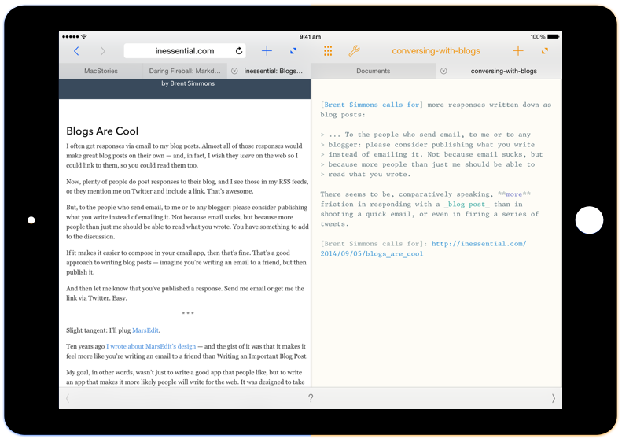

  <!-- Split bar -->
  

    

    

    

    

  

  <!-- App name and description -->
  

    bisect
  

  

    A split-screen Markdown editor for the
    iPad
  

  <!-- Get notified button -->
  

    <a href="#get-notified" class="get-notified-link">Get notified</a>
  

  <!-- Main image -->
  

  

  <!-- Split bar -->
  

    

    

    

    

  

