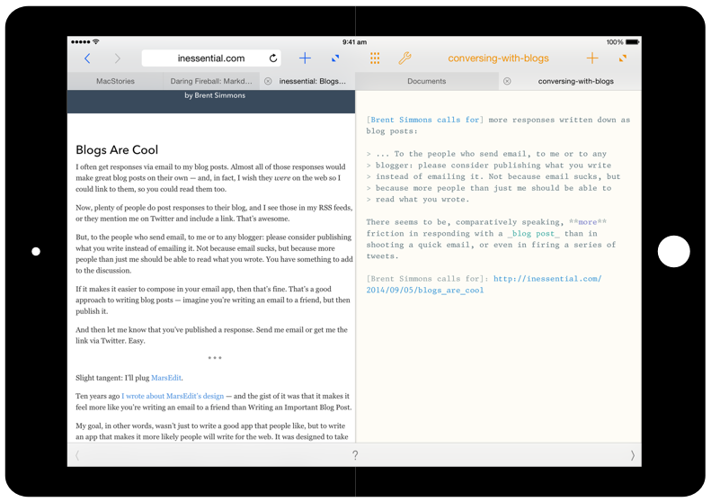
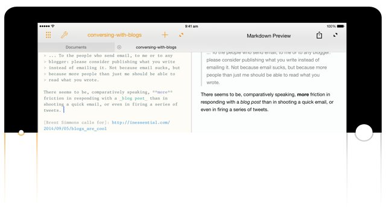
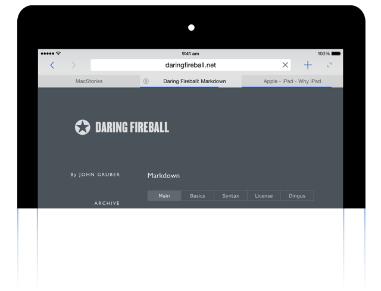
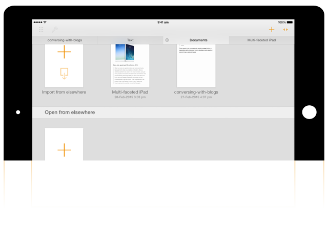

<!-- App name and description -->

  bisect

  A split-screen Markdown editor for the iPad

<!-- Get notified button -->

  <a href="/blog/">Blog</a>
  &nbsp;&nbsp;&nbsp;&nbsp;
  <a href="#join-beta" class="get-notified-link">Join Beta</a>
  &nbsp;&nbsp;&nbsp;&nbsp;
  <a href="/privacy/">Privacy</a>

<!-- Main image -->
<article class="main-image-container">
</article>

<!-- Signup -->

  

  

Sign up to participate in the beta program. 
<small>(Bisect requires an iPad running iOS 8)</small> 

<form action="http://bisectapp.createsend.com/t/i/s/jryhdu/" method="post" id="subForm">
    

        <input id="fieldEmail"
               name="cm-jryhdu-jryhdu"
               type="email"
               placeholder="your@email.com"
               required />
    

    

        <button type="submit">Count me in</button>
    

</form>

<!-- Features -->

  

  

<section>

  <h2>Instant Markdown</h2>
  
In landscape orientation, you can optionally split the screen
  to see a live preview of the Markdown text. The preview updates
  as you type and scrolls automatically to the changed text.

  
Bisect provides a quicktype bar for Markdown that
  dynamically changes based on what you're typing. From the
  quicktype bar, you can add emphasis, see what a text links to,
  insert URLs from the browser, and more. When using link
  references, the quicktype bar suggests references defined in the
  document.

</section>

  

  

<section>

  <h2>Integrated Browser</h2>
  
Sometimes, reading and surfing the web is an essential part of
  the writing process. Bisect comes with a tabbed browser
  that's tightly integrated with the editor, so you can add links to
  the Markdown text right from the browser.

  
You can either use the browser full-screen, or split the screen
  (when in landscape orientation) so you can refer to the web while writing.
  Switching between full-screen and split-screen modes just takes a single
  tap.

</section>

  

  

<section>

  <h2>Free your Text</h2>
  
You can open your text documents from other
  apps (or document provider extensions) and edit them
  in-place using Bisect. You can also move or export documents to other
  apps and document providers.

  
Bisect goes all the way in adopting how iOS 8 handles documents,
  allowing you to seamlessly switch between apps to work on one
  text document without making a trail of copies in different apps.

</section>

  

  

<!-- Footer -->

Bisect is being Made in India
by <a href="http://roopc.net/">Roopesh Chander</a>

