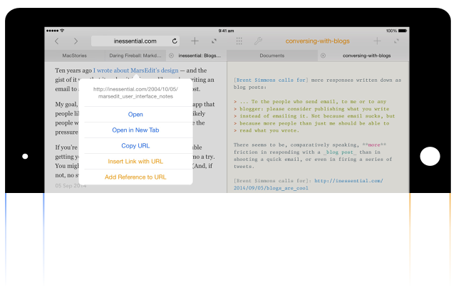
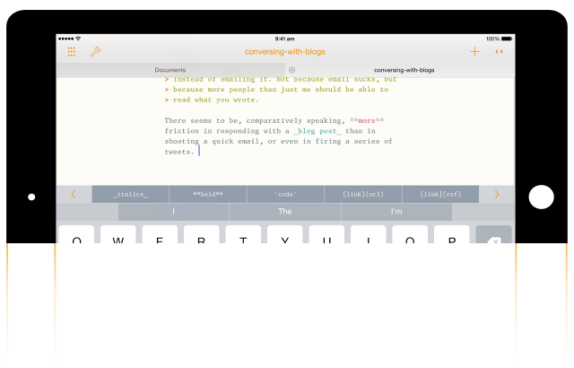

<!-- App name and description -->

  bisect

  A split-screen Markdown editor for the iPad

<section>

  <h2>Bisect has <a href="http://roopc.net/posts/2016/sunsetting-bisect/">shut down</a>.</h2>

</section>

<!-- Main image -->
<article class="main-image-container">
</article>

<!-- Features -->

  

  

<section>

  <h2>Split-screen for Markdown</h2>

  
Bisect's split-screen multitasking capability is optimized for writing
  Markdown. The in-built browser is tightly integrated with the editor,
  so you can add links to the Markdown text right from the browser.

  
You can quickly get to the traditional full-screen mode,
  and even then, switching between the browser, the editor and the live
  preview is just a swipe away. Bisect's split-screen multitasking
  capability is independent of and unrelated to the Split View feature
  in iOS 9.

</section>

  

  

<section>

  <h2>Live Preview</h2>

  
See a live preview of the Markdown you're writing, as you write, in
  split-screen mode. The preview updates as you type and scrolls
  automatically to the changed text.

</section>

  

  

<section>

  <h2>Markdown Superpowers</h2>

  
Bisect provides a quicktype bar for Markdown that dynamically
  changes based on what you’re typing. From the quicktype bar, you can
  add emphasis, see what a text links to, insert URLs from the browser,
  and more.

  
When using link references, the editor highlights undefined
  references as you type, and the quicktype bar suggests completions
  based on references defined elsewhere in the document.

</section>

  

  

<section>

  <h2>Free your Text</h2>
  
You can open your text documents from other
  apps (or document provider extensions) and edit them
  in-place using Bisect. You can also move or export documents to other
  apps and document providers.

  
Bisect goes all the way in adopting how iOS 8 handles documents,
  allowing you to seamlessly switch between apps to work on one
  text document without making a trail of copies in different apps.

</section>

<!-- Signup -->

  

  

Bisect has <a
href="http://roopc.net/posts/2016/sunsetting-bisect/">shut down</a>
and is no longer available for sale.

  

  

<!-- Footer -->

  © 2015 Roopesh Chander
  &nbsp;&nbsp;•&nbsp;&nbsp;
  <a href="/contact/">Contact</a>
  &nbsp;&nbsp;•&nbsp;&nbsp;
  <a href="/privacy/">Privacy Policy</a>

<small>Apple, the Apple logo, and iPad are trademarks of Apple Inc., registered in the U.S. and other countries. App Store is a service mark of Apple Inc.</small>

